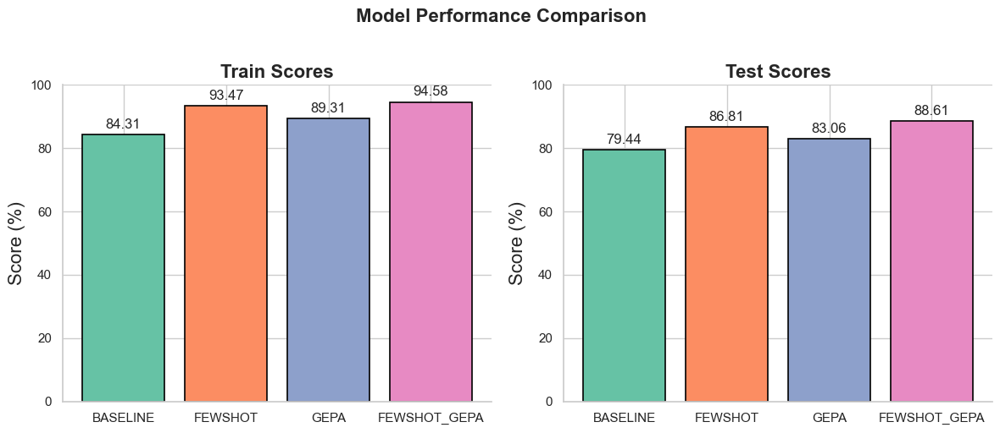

# DSPy: Intro Improved
[](https://www.python.org/downloads/release/python-3110/)
[](https://mlflow.org/docs/latest/index.html)
[](https://dspy.ai/docs/latest/index.html)

This is streamlined and improved version of the original tutorial by [Prashanth Rao](https://www.linkedin.com/in/prrao87/) that he presents in his blog [Learning DSPy](https://thedataquarry.com/blog/learning-dspy-1-the-power-of-good-abstractions/#define-success-metrics). It includes some general code improvements, migration to Jupyter Notebook, integrating MlFlow and implementation of data science best practices and other.

## Setup
Install dependencies via [uv](https://docs.astral.sh/uv/getting-started/installation/) as follows:
```bash
uv sync
```
Make sure you have [Docker](https://www.docker.com/products/docker-desktop/) installed and running for starting MlFlow server.


## Dive Into DSPy
The notebook [dspy_demo.ipynb](notebooks/dspy_demo.ipynb) contains the full tutorial. It is structured in a way that allows you to follow the tutorial one cell at the time.

## Optimizers Performance Comparison
The notebook uses BootstrapFewShotWithRandomSearch and GEPA optimizers to tune the DSPy program for articles extraction.

The results of running the notebook (note these result may vary across runs): 
